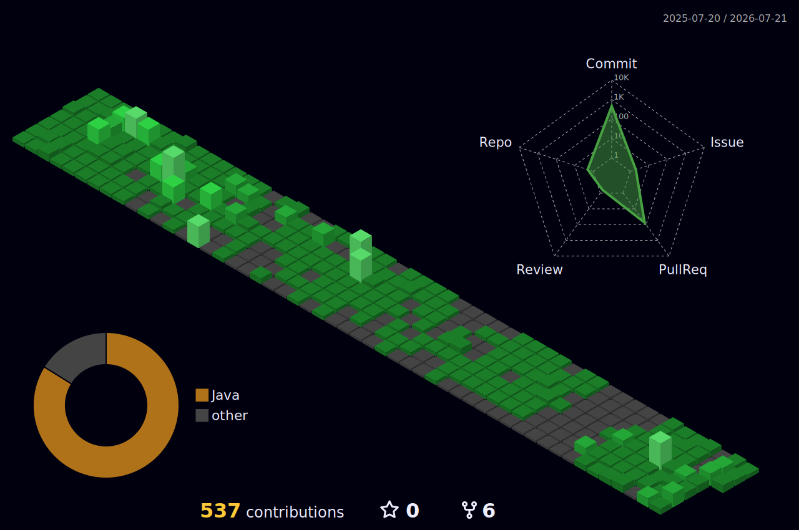

<h1>HyeonJin Song &nbsp;Back-end Developer </h1>

안정적인 서버와 API를 만드는 Spring 백엔드 개발자입니다. 
대용량 트래픽에도 흔들리지 않는 시스템과 깔끔한 데이터 설계를 고민해요.

 

## 🛠️ Tech Stack

**Backend**

**Database & Messaging**

**Infra & Tools**

 

## 🧩 Problem Solving

  

## 📊 Contribution

